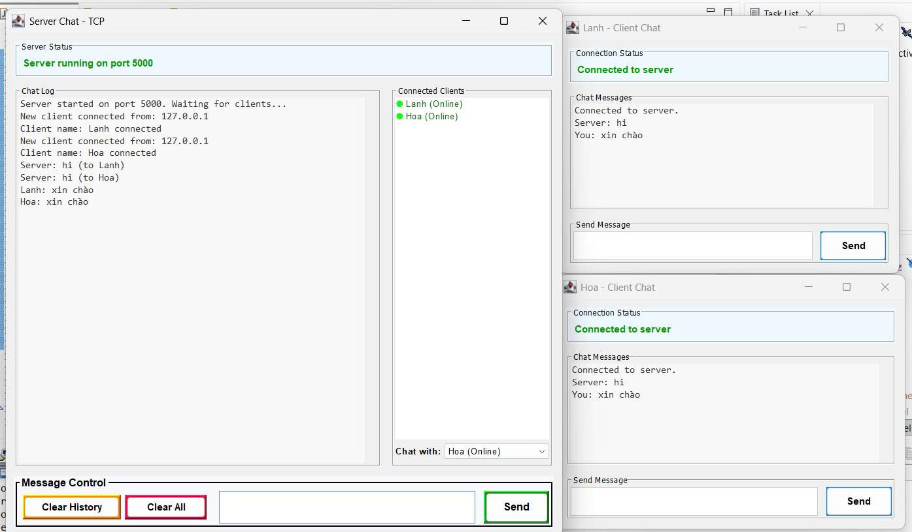
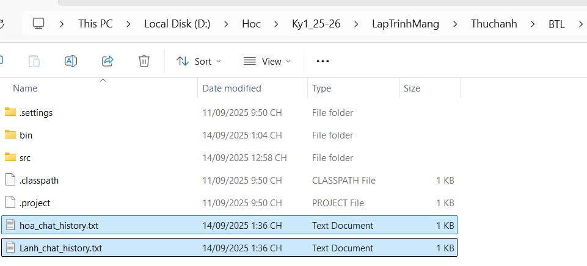
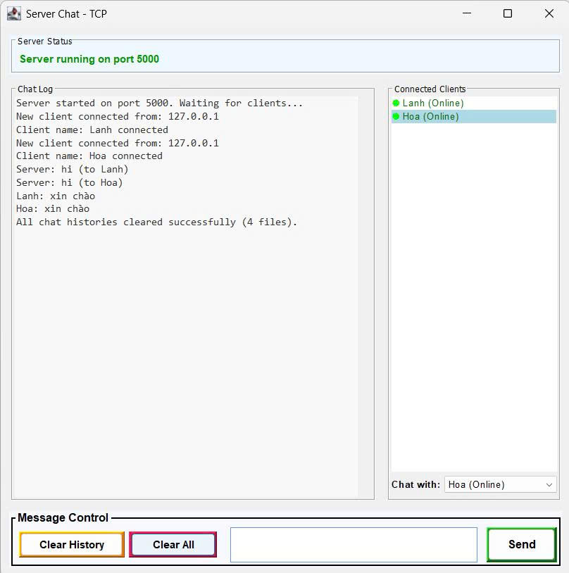
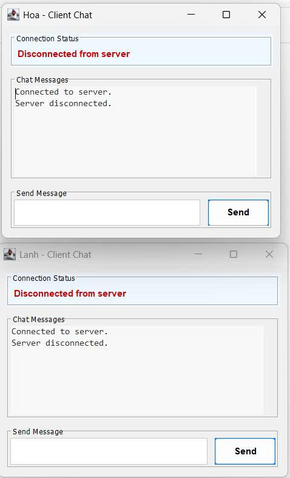

<h2 align="center">
    <a href="https://dainam.edu.vn/vi/khoa-cong-nghe-thong-tin">
    🎓 Faculty of Information Technology (DaiNam University)
    </a>
</h2>
<h2 align="center">
   XÂY DỰNG ỨNG DỤNG CHAT CLIENT-SERVER SỬ DỤNG GIAO THỨC TCP
</h2>
<div align="center">
    <p align="center">
        
        
        
    </p>

[](https://www.facebook.com/DNUAIoTLab)
[](https://dainam.edu.vn/vi/khoa-cong-nghe-thong-tin)
[](https://dainam.edu.vn)

</div>


## 📖 1. Giới thiệu hệ thống
Ứng dụng chat Client-Server sử dụng giao thức TCP cho phép nhiều người dùng giao tiếp thời gian thực qua mạng.  
**Server**: đóng vai trò trung tâm, quản lý kết nối và chuyển tiếp tin nhắn.  
**Client**: cung cấp giao diện để gửi/nhận tin nhắn.  
**Lưu trữ dữ liệu**: lịch sử chat được lưu vào file văn bản thay vì cơ sở dữ liệu, giúp triển khai đơn giản.  
Các chức năng chính:  
**Server**:  
🔌 Kết nối.  
💬 Chức năng Chat.  
📁 Quản lý Lịch sử.  
🗑️ Xóa Lịch sử.  
👥 Quản lý Client.  
**Client**:  
🔗 Kết nối.  
💬 Chức năng Chat.  
📨 Xử lý Tin nhắn.  
🔄 Quản lý Trạng thái.  
**Hệ thống**:  
🌐 Giao thức TCP: Dùng ServerSocket và Socket, hỗ trợ nhiều client qua đa luồng.  
💾 Lưu trữ Dữ liệu: File I/O (append mode), ghi timestamp bằng LocalDateTime.  
🛡️ Xử lý Lỗi: Thông báo lỗi trong GUI, debug log, graceful shutdown.


## 🔧 2. Công nghệ sử dụng
Các công nghệ được sử dụng để xây dựng ứng dụng chat Client-Server sử dụng TCP với Java Swing  
#### Java Core và Multithreading:
#### Java Swing:
#### Java Sockets:  
#### File I/O:
#### Hỗ trợ:  

    java.util.Date hoặc java.time.LocalDateTime: Tạo timestamp cho mỗi tin nhắn để ghi vào file và hiển thị trên giao diện, giúp người dùng theo dõi thời gian gửi.
    ArrayList: Quản lý danh sách các client đang kết nối trên server (lưu trữ PrintWriter hoặc DataOutputStream của từng client) để broadcast tin nhắn. Có thể mở rộng để lưu danh sách tên người dùng và trạng thái online/offline.
Không sử dụng thư viện bên ngoài, đảm bảo ứng dụng nhẹ và dễ triển khai trên mọi môi trường Java.

## 🚀 3. Hình ảnh các chức năng

<p align="center">
  
</p>

<p align="center">
  <em>Hình 1: Ảnh giao diện chat giữa Client-Server  </em>
</p>

<p align="center">
  
</p>
<p align="center">
  <em> Hình 2: Client chat với Server</em>
</p>


<p align="center">
  
</p>
<p align="center">
  <em> Hình 3: Hai Client chat với nhau.</em>
</p>

<p align="center">
  
</p>
<p align="center">
  <em> Hình 3: Ảnh lịch sử chat được lưu vào file txt </em>
</p>

<p align="center">
    
</p>
<p align="center">
  <em> Hình 4: Ảnh Server xóa dữ liệu</em>
</p>


<p align="center">
  
</p>
<p align="center">
  <em> Hình 5: Ảnh Server ngắt kết nối với CLient</em>
</p>

## 📝 4. Hướng dẫn cài đặt và sử dụng

### 🔧 Yêu cầu hệ thống

- **Java Development Kit (JDK)**: Phiên bản 8 trở lên
- **Hệ điều hành**: Windows, macOS, hoặc Linux
- **Môi trường phát triển**: IDE (IntelliJ IDEA, Eclipse, VS Code) hoặc terminal/command prompt
- **Bộ nhớ**: Tối thiểu 512MB RAM
- **Dung lượng**: Khoảng 10MB cho mã nguồn và file thực thi

### 📦 Cài đặt và triển khai

#### Bước 1: Chuẩn bị môi trường
1. **Kiểm tra Java**: Mở terminal/command prompt và chạy:
   ```bash
   java -version
   javac -version
   ```
   Đảm bảo cả hai lệnh đều hiển thị phiên bản Java 8 trở lên.

2. **Tải mã nguồn**: Sao chép thư mục `UngDungChat_TCP` chứa các file:
   - `Server.java`
   - `Client.java`

#### Bước 2: Biên dịch mã nguồn
1. **Mở terminal** và điều hướng đến thư mục chứa mã nguồn
2. **Biên dịch các file Java**:
   ```bash
   javac UngDungChat_TCP/*.java
   ```
   Hoặc biên dịch từng file riêng lẻ:
   ```bash
   javac UngDungChat_TCP/Server.java
   javac UngDungChat_TCP/Client.java
   ```

3. **Kiểm tra kết quả**: Nếu biên dịch thành công, sẽ tạo ra các file `.class` tương ứng.

#### Bước 3: Chạy ứng dụng

**Khởi động Server:**
```bash
java UngDungChat_TCP.Server
```
- Server sẽ khởi động trên port mặc định (1234)
- Giao diện server sẽ hiển thị, sẵn sàng nhận kết nối từ client
- Server sẽ tạo file `chat_history.txt` để lưu lịch sử chat

**Khởi động Client:**
```bash
java UngDungChat_TCP.Client
```
- Mở terminal mới cho mỗi client
- Nhập tên người dùng khi được yêu cầu (ví dụ: "Lanh", "Hoa", "Minh")
- Client sẽ kết nối đến server và hiển thị giao diện chat

### 🚀 Sử dụng ứng dụng

1. **Kết nối**: Client tự động kết nối đến server sau khi nhập tên
2. **Gửi tin nhắn**: Gõ tin nhắn vào ô nhập và nhấn Enter hoặc nút "Gửi"
3. **Nhận tin nhắn**: Tin nhắn từ các client khác sẽ hiển thị trong khu vực chat
4. **Lịch sử chat**: Server tự động lưu tất cả tin nhắn vào file `chat_history.txt`
5. **Ngắt kết nối**: Đóng cửa sổ client hoặc nhấn Ctrl+C để ngắt kết nối


## Thông tin liên hệ  
Họ tên: Nguyễn Thị Lan Anh.  
Lớp: CNTT 16-03.  
Email: lananh.2402.nt@gmail.com.

© 2025 AIoTLab, Faculty of Information Technology, DaiNam University. All rights reserved.

---


