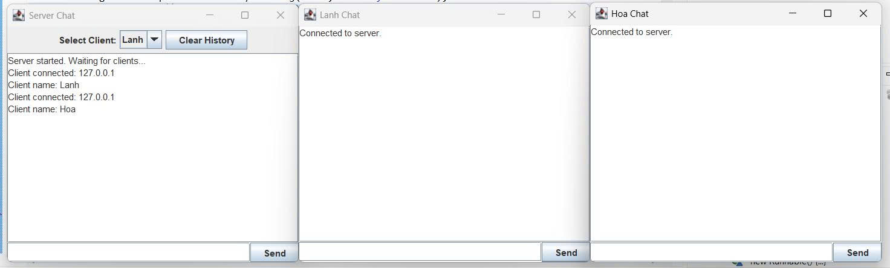
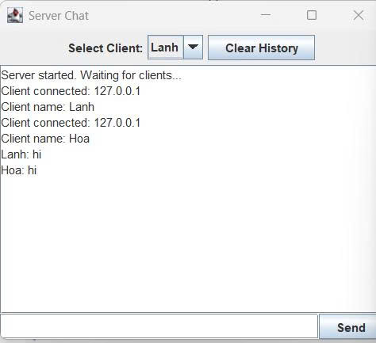
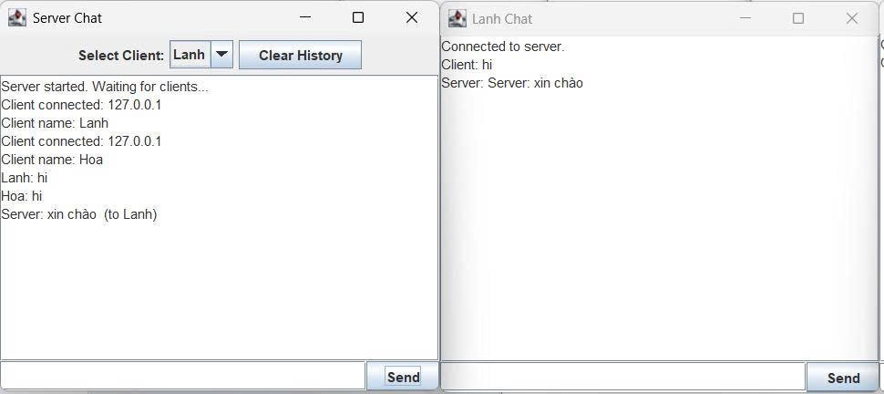
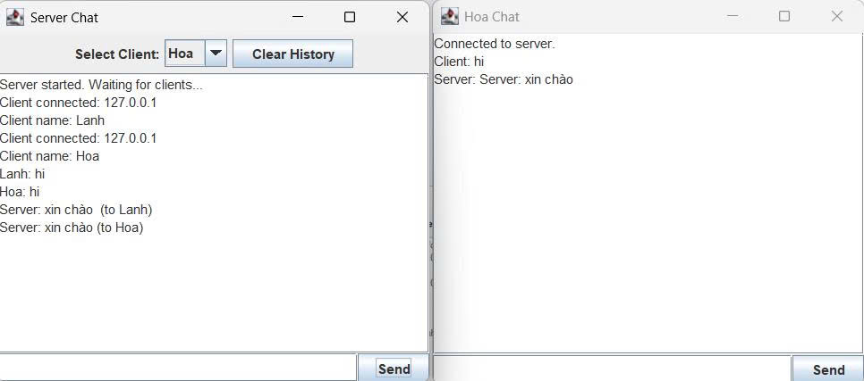
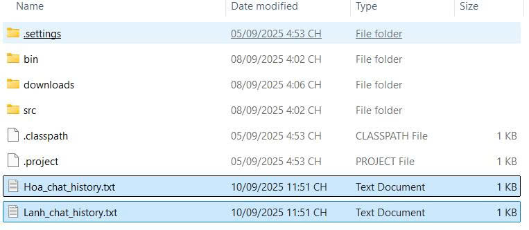
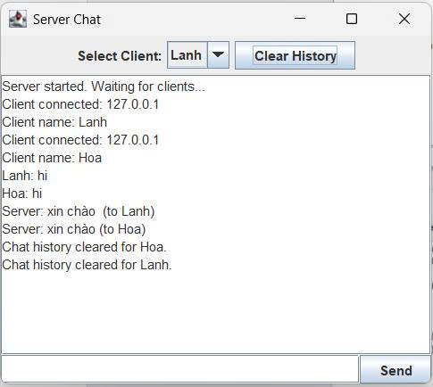
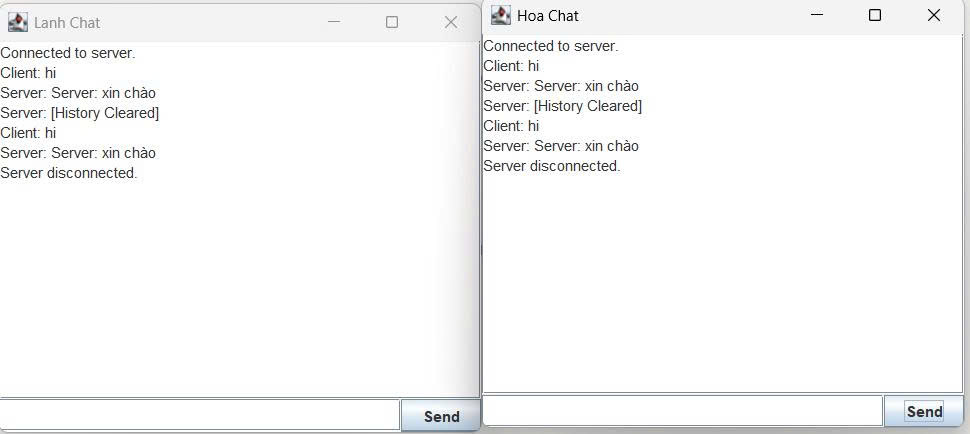

<h2 align="center">
    <a href="https://dainam.edu.vn/vi/khoa-cong-nghe-thong-tin">
    🎓 Faculty of Information Technology (DaiNam University)
    </a>
</h2>
<h2 align="center">
   XÂY DỰNG ƯNG DỤNG CHAT CLIENT-SERVER SỬ DỤNG GIAO THỨC TCP
</h2>

    

        
        
        
    

## 📖 1. Giới thiệu hệ thống
Ứng dụng chat Client-Server sử dụng giao thức TCP cho phép nhiều người dùng giao tiếp thời gian thực qua mạng. Server đóng vai trò trung tâm, quản lý kết nối và chuyển tiếp tin nhắn, trong khi client cung cấp giao diện người dùng để gửi và nhận tin nhắn. Dữ liệu được lưu trữ dưới dạng file văn bản thay vì cơ sở dữ liệu, giúp đơn giản hóa triển khai.

Các chức năng chính: 
1. Kết nối và xác thực cơ bản: Client kết nối đến server qua địa chỉ IP và port (mặc định: 1234). Server hỗ trợ nhiều client đồng thời thông qua đa luồng.
2. Gửi và nhận tin nhắn: Người dùng gửi tin nhắn từ client, server nhận và phát tán (broadcast) đến tất cả client khác, hỗ trợ chat nhóm.
3. Lưu trữ lịch sử chat: Server lưu tin nhắn vào file chat_history.txt với định dạng [Timestamp] - [Tên người dùng]: [Nội dung]. Client mới có thể tải lịch sử từ file.
4. Quản lý người dùng: Server theo dõi danh sách client online, cập nhật khi có kết nối/ngắt kết nối. Client hiển thị danh sách này (tùy chọn).
5. Giao diện người dùng: Sử dụng Java Swing với cửa sổ chat gồm khu vực hiển thị tin nhắn, ô nhập văn bản và nút gửi.
6. Xử lý lỗi: Xử lý các trường hợp như mất kết nối hoặc lỗi ghi file.
Hệ thống sử dụng TCP để đảm bảo truyền tin nhắn đáng tin cậy, không hỗ trợ mã hóa hoặc bảo mật nâng cao trong phiên bản cơ bản.

## 🔧 2. Công nghệ sử dụng
Dưới đây là mô tả chi tiết về các công nghệ được sử dụng để xây dựng ứng dụng chat Client-Server sử dụng TCP với Java Swing, dựa trên yêu cầu của bạn:

#### Java Core và Multithreading:
Sử dụng ExecutorService (thuộc gói java.util.concurrent) để quản lý một pool các luồng (thread) trên server, cho phép xử lý đồng thời nhiều kết nối client mà không cần tạo thủ công từng Thread. Điều này giúp cải thiện hiệu suất và quản lý tài nguyên hiệu quả hơn so với sử dụng Thread trực tiếp. Ví dụ: Executors.newFixedThreadPool() được dùng để giới hạn số luồng tối đa, mỗi luồng xử lý một client.

#### Java Swing:
Xây dựng giao diện đồ họa (GUI) cho client sử dụng các thành phần của gói javax.swing.*:

    JFrame: Cửa sổ chính của ứng dụng client.
    JTextArea: Hiển thị lịch sử tin nhắn, đặt trong JScrollPane để hỗ trợ cuộn khi số lượng tin nhắn dài.
    JTextField: Ô nhập liệu để người dùng gõ tin nhắn.
    JButton: Nút "Gửi" để gửi tin nhắn khi nhấn hoặc khi nhấn Enter.
    JScrollPane: Bao quanh JTextArea để cung cấp thanh cuộn, cải thiện trải nghiệm người dùng.

Swing cung cấp giao diện thân thiện, dễ tùy chỉnh mà không cần thư viện bên ngoài.

#### Java Sockets:
Sử dụng gói java.net.* để triển khai kết nối mạng theo giao thức TCP:

    ServerSocket: Được server sử dụng để lắng nghe các kết nối đến trên một cổng cụ thể (ví dụ: port 1234). Phương thức accept() trả về Socket cho mỗi client kết nối.
    Socket: Được client sử dụng để kết nối đến server thông qua địa chỉ IP và port.
    DataInputStream và DataOutputStream: Xử lý việc đọc/ghi dữ liệu dạng nhị phân giữa client và server, đảm bảo truyền tin nhắn chính xác, tuần tự và không mất mát. 

Đây là lựa chọn phù hợp khi cần truyền dữ liệu đơn giản như chuỗi văn bản.

#### File I/O:

Sử dụng các lớp trong gói java.io.* để lưu trữ và truy xuất lịch sử chat:

    FileWriter hoặc BufferedWriter: Ghi tin nhắn vào file văn bản (ví dụ: chat_history.txt) theo chế độ append để không ghi đè dữ liệu cũ. Mỗi tin nhắn được lưu với định dạng như [Timestamp] - [Tên người dùng]: [Nội dung].
    BufferedReader: Đọc lịch sử tin nhắn từ file để hiển thị khi client mới kết nối hoặc khi người dùng yêu cầu tải lịch sử.
Sử dụng từ khóa synchronized hoặc Lock (từ java.util.concurrent.locks) để đảm bảo an toàn luồng (thread-safe) khi nhiều client gửi tin nhắn đồng thời, tránh xung đột ghi file.

#### Hỗ trợ:

    java.util.Date hoặc java.time.LocalDateTime: Tạo timestamp cho mỗi tin nhắn để ghi vào file và hiển thị trên giao diện, giúp người dùng theo dõi thời gian gửi.
    ArrayList: Quản lý danh sách các client đang kết nối trên server (lưu trữ PrintWriter hoặc DataOutputStream của từng client) để broadcast tin nhắn. Có thể mở rộng để lưu danh sách tên người dùng và trạng thái online/offline.
Không sử dụng thư viện bên ngoài, đảm bảo ứng dụng nhẹ và dễ triển khai trên mọi môi trường Java.

## 🚀 3. Hình ảnh các chức năng

  

  <em>Hình 1: Ảnh giao diện chat giữa Client-Server  Hình 2: Ảnh 2 Client chat với Server</em>

  

  <em> Hình 2: Ảnh 2 Client chat với Server</em>

  
    

  <em> Hình 3: Ảnh Server trả lời Client Lanh - Hình 4: Ảnh Server trả lời Client Hoa</em>

  
    

  <em> Hình 5: Ảnh lịch sử chat được lưu vào file txt - Hình 5: Ảnh Server xóa dữ liệu</em>

  

  <em> Hình 7: Ảnh Server ngắt kết nối với CLient</em>

## 📝 4. Các bước cài đặt

Yêu cầu hệ thống:

    Java Development Kit (JDK) phiên bản 8 hoặc cao hơn.
    Môi trường phát triển hoặc terminal để biên dịch và chạy mã.

Các bước cài đặt và chạy

Chuẩn bị mã nguồn:

Tải hoặc sao chép hai file: Server.java và Client.java vào cùng một thư mục (package UngDungChat_TCP).

Biên dịch mã nguồn:

Mở terminal, điều hướng đến thư mục chứa file.

Chạy lệnh:

    textjavac UngDungChat_TCP/*.java

Đảm bảo không có lỗi biên dịch.

Chạy Server:

Trong terminal, chạy:

    textjava UngDungChat_TCP.Server

Server sẽ khởi động và hiển thị giao diện, chờ kết nối từ client.

Chạy Client:

Mở một terminal mới (hoặc nhiều terminal để chạy nhiều client).

Chạy:

    textjava UngDungChat_TCP.Client

Nhập tên client (ví dụ: "Lanh", "Hoa:) khi dialog xuất hiện, client sẽ kết nối đến server.

© 2025 AIoTLab, Faculty of Information Technology, DaiNam University. All rights reserved.

---
