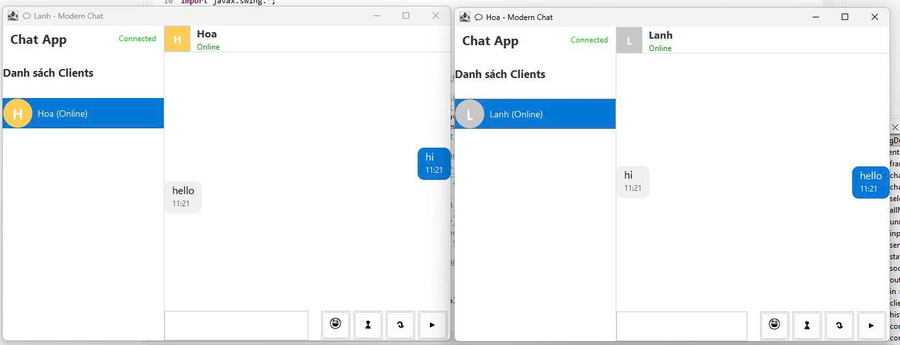

<h2 align="center">
    <a href="https://dainam.edu.vn/vi/khoa-cong-nghe-thong-tin">
    🎓 Faculty of Information Technology (DaiNam University)
    </a>
</h2>
<h2 align="center">
   XÂY DỰNG ỨNG DỤNG CHAT CLIENT-SERVER SỬ DỤNG GIAO THỨC TCP
</h2>
<div align="center">
    <p align="center">
        
        
        
    </p>

[](https://www.facebook.com/DNUAIoTLab)
[](https://dainam.edu.vn/vi/khoa-cong-nghe-thong-tin)
[](https://dainam.edu.vn)

</div>


## 📖 1. Giới thiệu hệ thống
Ứng dụng chat Client-Server hiện đại sử dụng giao thức TCP với giao diện Java Swing, hỗ trợ nhiều tính năng tiên tiến cho việc giao tiếp thời gian thực qua mạng.  

**🏗️ Kiến trúc hệ thống**:  
- **Server**: Đóng vai trò trung tâm với giao diện admin chuyên nghiệp, quản lý kết nối và chuyển tiếp tin nhắn giữa các client
- **Client**: Giao diện chat hiện đại với bubble messages, hỗ trợ đa phương tiện và tương tác phong phú
- **Authentication**: Hệ thống xác thực admin với mã hóa SHA-256, đảm bảo bảo mật
- **Lưu trữ dữ liệu**: Lịch sử chat được lưu vào file văn bản với timestamp chính xác đến phút

**🎯 Các chức năng chính**:  

**🖥️ Server (Admin Interface)**:  
- 🔐 **Admin Authentication**: Đăng nhập/đăng ký admin với giao diện khoa học, chuyên nghiệp
- 🔌 **Connection Management**: Quản lý kết nối real-time của các client
- 💬 **Message Routing**: Chuyển tiếp tin nhắn, file, ảnh, voice giữa các client
- 📁 **History Management**: Quản lý và xóa lịch sử chat với giao diện tabbed
- 👥 **Client Monitoring**: Hiển thị danh sách client online/offline và admin đã đăng nhập
- 🎨 **Modern UI**: Giao diện bubble chat với màu sắc hiện đại, message panel responsive

**💻 Client (User Interface)**:  
- 🔗 **Smart Connection**: Kết nối tự động với server, hiển thị trạng thái real-time
- 💬 **Rich Chat**: Bubble messages với timestamp, hỗ trợ emoji và text formatting
- 📎 **File Transfer**: Gửi/nhận file với preview dialog, hỗ trợ tất cả định dạng
- 🖼️ **Image Sharing**: Gửi/nhận ảnh với thumbnail preview, auto-resize
- 🎤 **Voice Chat**: Ghi âm và gửi voice message, playback với audio controls
- 😀 **Avatar System**: Thay đổi avatar với 100+ emoji options
- 📱 **Contact Management**: Danh sách contact với trạng thái online/offline
- 💾 **Local History**: Lưu trữ lịch sử chat local, persistent across sessions

**⚙️ Hệ thống kỹ thuật**:  
- 🌐 **TCP Protocol**: ServerSocket và Socket với multithreading, hỗ trợ nhiều client đồng thời
- 🔄 **Message Queuing**: Hàng đợi tin nhắn offline, đảm bảo không mất dữ liệu
- 💾 **Data Persistence**: File I/O với UTF-8 encoding, timestamp chính xác
- 🛡️ **Error Handling**: Xử lý lỗi graceful với thông báo user-friendly
- 🎨 **Modern UI**: Java Swing với custom rendering, hover effects, responsive design
- 🔧 **Modular Architecture**: Code được tổ chức thành các module riêng biệt, dễ maintain và extend


## 🔧 2. Công nghệ sử dụng
Ứng dụng được xây dựng hoàn toàn bằng **Java Core** không sử dụng thư viện bên ngoài:

- **☕ Java 8+**: Multithreading với `Thread`, `ConcurrentHashMap`, `AtomicBoolean`
- **🎨 Java Swing**: UI components, custom rendering, event handling
- **🌐 TCP Sockets**: `ServerSocket` (port 12345), `Socket`, `PrintWriter`, `BufferedReader`
- **💾 File I/O**: UTF-8 encoding, Base64 cho file transfer, `JFileChooser`
- **🎵 Audio API**: `javax.sound.sampled.*` cho voice recording/playback
- **🔐 Security**: SHA-256 password hashing, serialization cho admin data
- **📊 Data**: `ArrayList`, `HashMap`, custom classes, `SimpleDateFormat`

**✨ Lightweight & Portable**: Chỉ sử dụng Java Standard Library, dễ triển khai trên mọi môi trường.

## 🚀 3. Hình ảnh các chức năng

<p align="center">
  
</p>

<p align="center">
  <em>Hình 1: Ảnh giao diện chat giữa Client-Server  </em>
</p>

<p align="center">
  
</p>
<p align="center">
  <em> Hình 2: Client chat với nhau</em>
</p>


<p align="center">
  
</p>
<p align="center">
  <em> Hình 3: Ảnh lịch sử chat được lưu vào file txt </em>
</p>

<p align="center">
    
</p>
<p align="center">
  <em> Hình 4: Ảnh Server xóa dữ liệu</em>
</p>


<p align="center">
  
</p>
<p align="center">
  <em> Hình 5: Ảnh Server ngắt kết nối với CLient</em>
</p>

## 📝 4. Hướng dẫn cài đặt và sử dụng

### 🔧 Yêu cầu hệ thống
- **JDK 8+** (khuyến nghị JDK 11+)
- **RAM**: Tối thiểu 1GB
- **OS**: Windows 10+, macOS 10.14+, Linux Ubuntu 18.04+
- **Audio**: Microphone/speakers (tùy chọn cho voice chat)

### 📦 Cài đặt nhanh
```bash
# 1. Kiểm tra Java
java -version && javac -version

# 2. Biên dịch
javac UngDungChat_TCP/*.java
# 3. Chạy Server (bắt buộc trước)
java UngDungChat_TCP.Server

# 4. Chạy Client (terminal mới)
java UngDungChat_TCP.Client
```

### 🚀 Sử dụng
**🖥️ Server**: Đăng nhập admin → Quản lý client → Gửi tin nhắn  
**💻 Client**: Nhập tên → Chọn contact → Chat với file/ảnh/voice/avatar

**✨ Tính năng**: File transfer, image sharing, voice chat, avatar system, offline messages, modern UI


## Thông tin liên hệ  
Họ tên: Nguyễn Thị Lan Anh.  
Lớp: CNTT 16-03.  
Email: lananh.2402.nt@gmail.com.

© 2025 AIoTLab, Faculty of Information Technology, DaiNam University. All rights reserved.

---

